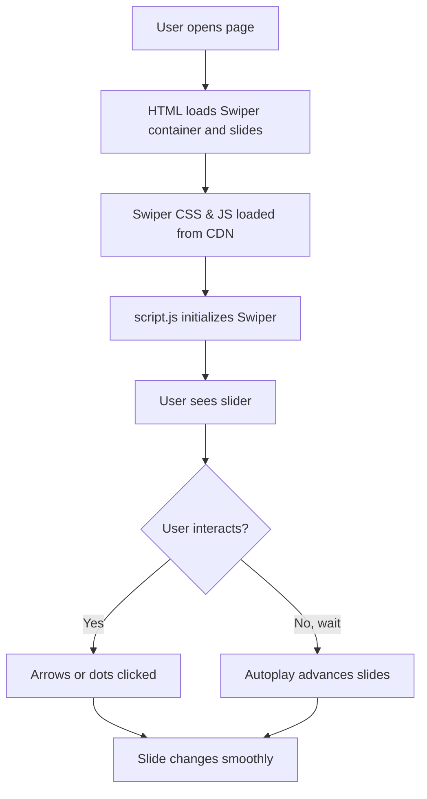

# Swiper JS Simple Demo 🌀

This project is a quick demo for learning how to use [Swiper.js](https://swiperjs.com/) — a popular, modern JavaScript slider library. Here’s a breakdown of how I set up a basic slider, styled it, and made it work with Swiper's navigation and pagination!

---

## What’s in This Demo? 🔎

- **index.html**: Sets up the slider and includes Swiper's resources.
- **style.css**: Adds custom styles for a dark, modern look.
- **script.js**: Initializes Swiper and makes it interactive.

---

## index.html

This file is the main structure of the webpage. It includes the HTML for the slider, brings in Swiper's CSS/JS from CDN, and links to my custom CSS and JS.

```html
<!DOCTYPE html>
<html lang="en">
<head>
  <meta charset="UTF-8">
  <meta name="viewport" content="width=device-width, initial-scale=1.0">
  <!-- Fonts and Swiper CSS -->
  <link rel="preconnect" href="https://fonts.googleapis.com">
  <link rel="preconnect" href="https://fonts.gstatic.com" crossorigin>
  <link href="https://fonts.googleapis.com/css2?family=Poppins:wght@100;200;300;400;500;600;700;800;900&display=swap" rel="stylesheet">
  <link rel="stylesheet" href="https://cdn.jsdelivr.net/npm/swiper@12/swiper-bundle.min.css" />
  <link rel="stylesheet" href="style.css">
  <title>Document</title>
</head>
<body>
  <div class="swiper">
    <div class="swiper-wrapper">
      <div class="swiper-slide">Slide 1</div>
      <div class="swiper-slide">Slide 2</div>
      <div class="swiper-slide">Slide 3</div>
      <div class="swiper-slide">Slide 4</div>
      <div class="swiper-slide">Slide 5</div>
    </div>
  </div>
  <!-- Swiper navigation and pagination -->
  <div class="swiper-button-next"></div>
  <div class="swiper-button-prev"></div>
  <div class="swiper-pagination"></div>
  <script src="https://cdn.jsdelivr.net/npm/swiper@12/swiper-bundle.min.js"></script>
  <script src="script.js"></script>
</body>
</html>
```

### How I Built It

- **Swiper container**: `<div class="swiper">` is the main slider.
- **Slides**: Each `<div class="swiper-slide">` is a slide.
- **Navigation**: Added `.swiper-button-next` and `.swiper-button-prev` for arrows.
- **Pagination**: `.swiper-pagination` is for those clickable dots.
- **CDN**: Pulled in Swiper's CSS and JS from CDN for ease.
- **Custom code**: Linked to my own `style.css` and `script.js`.

---

## style.css

This file gives the slider its unique look—dark theme, big text, and centered slides.

```css
* {
  margin: 0;
  padding: 0;
  box-sizing: border-box;
  font-family: 'Poppins';
}

body {
  width: 100%;
  height: 100vh;
  background-color: #000;
  color: white;
}

.swiper {
  height: 100%;
  width: 100%;
  background-color: #333;
  padding: 30px;
}

.swiper-slide {
  display: flex;
  align-items: center;
  justify-content: center;
  font-size: 5rem;
}

/* Unused: custom next/previous buttons (for experiment!) */
.next,
.previous {
  position: absolute;
  top: 50%;
  background-color: crimson;
  padding: 5px 10px;
  transform: translate(0, -50%);
  border-radius: 5px;
  z-index: 10;
}
.next { right: 5%; }
.previous { left: 5%; }
```

### What I Did Here

- **Full-screen dark look**: Black background, white text.
- **Centered slides**: `display: flex` and centering for nice alignment.
- **Big text**: Slides use a `5rem` font size for easy reading.
- **Custom fonts**: Uses Poppins from Google Fonts for that smooth look.
- **Swiper container styling**: Added padding and dark background.
- **Experimented**: I tried custom next/prev buttons (commented out in HTML, but left styles in case I want to swap them in later!).

---

## script.js

This file actually makes the slider interactive. Here I set up Swiper with options I wanted.

```js
var swiper = new Swiper('.swiper', {
  navigation: {
    nextEl : '.swiper-button-next',
    prevEl : '.swiper-button-prev'
  },
  pagination: {
    el: ".swiper-pagination",
    dynamicBullets: true,
  },
  loop: true,
  autoplay: true
});
```

### What’s Happening?

- **navigation**: Tells Swiper to use the default next/prev buttons.
- **pagination**: Enables and styles the dots under the slider.
- **loop**: Slides loop infinitely.
- **autoplay**: Slides move automatically (no need to click!).

---

## How Does the Slider Work? 🛝

Here’s a quick flow of how the pieces connect:



---

## Customization Ideas 💡

- Change the number of slides.
- Update slide content (images, text, etc).
- Try turning off autoplay or loop.
- Style navigation buttons differently.
- Use custom navigation instead of Swiper's default (uncomment my `.next` and `.previous` HTML & CSS).

---

```card
{
  "title": "Tip: Experiment with Options",
  "content": "Swiper has tons of settings—try tweaking them in script.js to see what changes!"
}
```

---

## Why I Did It This Way

- **Kept it simple**: Used CDN versions—no builds or complicated setup.
- **Learn-by-doing**: Wrote minimal code to focus on what Swiper needs.
- **Easy to extend**: Can add more slides, styles, or features later.

---

### Helpful Links

- [Swiper.js Docs](https://swiperjs.com/)
- [Swiper Demos](https://swiperjs.com/demos)
- [Poppins Font](https://fonts.google.com/specimen/Poppins)

---

Enjoy playing with Swiper! 🎉
